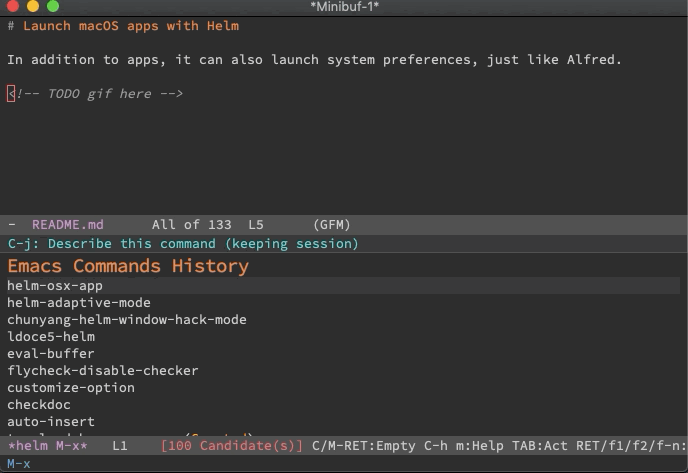

# Launch macOS apps with Helm

In addition to apps, it can also launch system preferences, just like Alfred.



To use, type `M-x helm-osx-app`.

## Requirements

- Emacs >= 25.1 for its builtin `seq` library

## Customization

### `helm-osx-app-app-folders`

Folders containing applications. Defaults to `("/Applications" "~/Applications")`.

### `helm-osx-app-pref-folders`

Folders containing system preferences. Defaults to

``` emacs-lisp
("/System/Library/PreferencePanes"
 "/Library/PreferencePanes"
 "~/Library/PreferencePanes")
```

### `helm-osx-app-actions`

Actions for `helm-osx-app`. Defaults to

- Open
- Reveal file in Finder

However, if you've marked multiple candidates, reveal only works for the last
candidate. It seems a bug of Apple's `open(1)`, the manual page says

> -R  Reveals the file(s) in the Finder instead of opening them.

but

``` shell
touch foo bar && open -R foo bar
```

reveals ONLY `bar`.

